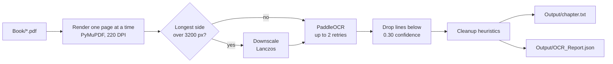

<div align="center">

# MakeBookFromScans

Turns scanned book chapters into clean UTF-8 text that you can hand to an LLM.<br>
Everything runs locally: PyMuPDF renders the pages and PaddleOCR reads them, on a GPU if you have one.

[![Python 3.12][badge-python]][link-python]
[![PaddleOCR][badge-paddle]][link-paddle]
[![PyMuPDF][badge-pymupdf]][link-pymupdf]
[![CUDA optional][badge-cuda]][link-cuda]
[![License: MIT][badge-license]](LICENSE)

</div>

## About

Raw OCR output from a book is full of page numbers, running headers, words hyphenated across line breaks and paragraphs broken at every line wrap. This pipeline runs PaddleOCR over each scanned chapter, cleans those problems up, and writes one text file per chapter along with a JSON report that shows which chapters need a second look.

I used it to digitise a 33-chapter, 202-page scanned book. No image or text leaves the machine; the only network access is PaddleOCR downloading its models on the first run.

## Results

From that book (the scans and text are not part of this repository):

| Metric | Value |
|---|---|
| Pages processed | 202 across 33 chapters |
| Failed pages | 0 |
| Mean OCR confidence | 96.1% (chapters ranged from 88.0% to 98.6%) |
| Total time | 9 min 11 s, about 2.7 s per page, on a CUDA GPU |

## How it works



Pages are rendered with a generator, so a long chapter never has to sit in memory all at once. Very high resolution scans are downscaled before OCR because PaddleOCR's preprocessing can use hundreds of megabytes on a single oversized page.

If PaddleOCR raises an error or returns no text, the page is retried. A page that still fails after the last retry is listed in the report and left blank in the output instead of stopping the run.

### Cleanup

`src/cleaner.py` turns OCR lines into paragraphs:

1. Normalises Unicode (NFKC) and removes soft hyphens.
2. Finds running headers and footers. A short line (100 characters or fewer, not ending in `.`, `!` or `?`) that repeats on at least a third of the chapter's pages, and on no fewer than three, is removed everywhere.
3. Removes lines that contain only a page number, with or without dashes around it.
4. Re-attaches a decorative drop cap that OCR read as its own line, so `T` followed by `he` becomes `The`.
5. Joins a word hyphenated at a line break when the next line starts in lowercase.
6. Starts a new paragraph when a line ends with sentence punctuation or a closing quote or bracket and the next line starts with a capital letter. Otherwise the lines are joined with a space.
7. Merges paragraphs that a page break split after a comma, semicolon or colon.
8. Collapses repeated spaces and blank lines.

## Getting started

### Install

Use Python 3.12 and a virtual environment:

```powershell
py -3.12 -m venv .venv
.\.venv\Scripts\Activate.ps1
python -m pip install --upgrade pip
```

Install PaddlePaddle for your hardware first. For an NVIDIA GPU with CUDA 11.8:

```powershell
python -m pip install paddlepaddle-gpu -i https://www.paddlepaddle.org.cn/packages/stable/cu118/
```

I used `paddlepaddle-gpu==3.0.0` from the `cu126` index. For a CPU-only setup:

```powershell
python -m pip install paddlepaddle -i https://www.paddlepaddle.org.cn/packages/stable/cpu/
```

Then install the rest:

```powershell
python -m pip install -r requirements.txt
```

The framework package is called `paddlepaddle-gpu` (or `paddlepaddle` for CPU), so `uv add paddle` installs the wrong thing. To check the active environment:

```powershell
python -c "import paddle; print(paddle.__version__, paddle.device.get_device())"
```

### Run

Put the chapter PDFs in `Book/` (the folder name is case-sensitive on Linux and macOS) and run:

```powershell
# PowerShell
$env:OCR_USE_GPU = "true"   # leave unset to use the CPU
python main.py
```

```bash
# bash
OCR_USE_GPU=true python main.py
```

Each PDF becomes `Output/<pdf name>.txt`, and the run summary goes to `Output/OCR_Report.json`. A progress bar shows each chapter's pages as they are processed.

### Configuration

All settings are environment variables:

| Variable | Default | What it does |
|---|---|---|
| `OCR_BOOK_DIR` | `Book` | Folder with the input PDFs |
| `OCR_OUTPUT_DIR` | `Output` | Where the text files and report are written |
| `OCR_RENDER_DPI` | `220` | Resolution used to render each page |
| `OCR_MAX_IMAGE_DIMENSION` | `3200` | Pages with a longer side above this are downscaled before OCR |
| `OCR_MIN_CONFIDENCE` | `0.30` | Recognised lines scoring below this are dropped (PaddleOCR 3.x) |
| `OCR_USE_GPU` | `false` | Run PaddleOCR on the GPU |
| `OCR_MAX_RETRIES` | `2` | Extra attempts per page before it is marked as failed |
| `OCR_LANGUAGE` | `en` | PaddleOCR language code |
| `OCR_LOG_LEVEL` | `INFO` | Python logging level |
| `OCR_WORKERS` | `1` | Reserved; pages are currently processed one at a time |

### The report

This is the real entry for the first chapter of the run above:

```json
{
  "chapters": [
    {
      "chapter_name": "Chapter 1",
      "page_count": 5,
      "ocr_confidence": 0.9263,
      "processing_time_seconds": 17.084,
      "failed_pages": [],
      "warnings": []
    }
  ]
}
```

`ocr_confidence` is the mean of the per-page mean scores. `warnings` holds the error message for each failed page and a note when header or footer lines were removed.

## PaddleOCR versions

`src/ocr.py` works with both PaddleOCR APIs. On 3.x it calls `predict()` and reads `rec_texts` and `rec_scores` from the result JSON; on 2.x it falls back to `ocr(image, cls=True)`. Device selection follows the same pattern: it tries the 3.x `device=` argument first and falls back to the 2.x `use_gpu` flag.

## Project layout

```
MakeBookFromScans/
├── main.py              CLI entry point
├── config.py            Settings, overridable with OCR_* environment variables
├── src/
│   ├── pdf_loader.py    Page rendering and downscaling (PyMuPDF)
│   ├── ocr.py           PaddleOCR wrapper, retries and the per-chapter loop
│   ├── cleaner.py       Header, page number, hyphenation and paragraph cleanup
│   ├── report.py        Writes OCR_Report.json
│   └── utils.py         Timer helper
├── requirements.txt
└── pyproject.toml
```

## Limitations

- The cleanup rules assume single-column prose. Tables, footnotes, captions and multi-column pages come out as plain lines.
- Header and footer detection needs the same line on at least three pages, so very short chapters keep theirs.
- The confidence filter only applies with PaddleOCR 3.x; the 2.x code path keeps every recognised line.
- `OCR_WORKERS` is not wired up yet, so there is no parallel processing.

## License

Released under the [MIT License](LICENSE).

## Author

Made by Rudra Somaiya.

[![GitHub][badge-github]][link-github]
[![LinkedIn][badge-linkedin]][link-linkedin]

[badge-python]: https://img.shields.io/badge/Python-3.12-3776AB?style=for-the-badge&logo=python&logoColor=white
[badge-paddle]: https://img.shields.io/badge/PaddleOCR-0062B0?style=for-the-badge&logo=paddlepaddle&logoColor=white
[badge-pymupdf]: https://img.shields.io/badge/PyMuPDF-E53935?style=for-the-badge
[badge-cuda]: https://img.shields.io/badge/CUDA-optional-76B900?style=for-the-badge&logo=nvidia&logoColor=white
[badge-license]: https://img.shields.io/badge/License-MIT-F7DF1E?style=for-the-badge
[badge-github]: https://img.shields.io/badge/GitHub-RudraSomaiya-181717?style=for-the-badge&logo=github&logoColor=white
[badge-linkedin]: https://img.shields.io/badge/LinkedIn-Rudra_Somaiya-0A66C2?style=for-the-badge&logo=data:image/svg%2bxml;base64,PHN2ZyB4bWxucz0iaHR0cDovL3d3dy53My5vcmcvMjAwMC9zdmciIHZpZXdCb3g9IjAgMCAyNCAyNCI+PHBhdGggZmlsbD0iI2ZmZiIgZD0iTTIwLjQ1IDIwLjQ1aC0zLjU2di01LjU3YzAtMS4zMy0uMDItMy4wNC0xLjg1LTMuMDQtMS44NSAwLTIuMTQgMS40NS0yLjE0IDIuOTR2NS42N0g5LjM1VjloMy40MXYxLjU2aC4wNWMuNDgtLjkgMS42NC0xLjg1IDMuMzctMS44NSAzLjYgMCA0LjI3IDIuMzcgNC4yNyA1LjQ2djYuMjh6TTUuMzQgNy40M2EyLjA2IDIuMDYgMCAxIDEgMC00LjEyIDIuMDYgMi4wNiAwIDAgMSAwIDQuMTJ6TTcuMTIgMjAuNDVIMy41NlY5aDMuNTZ2MTEuNDV6TTIyLjIyIDBIMS43N0MuNzkgMCAwIC43NyAwIDEuNzN2MjAuNTRDMCAyMy4yMy43OSAyNCAxLjc3IDI0aDIwLjQ1Yy45OCAwIDEuNzgtLjc3IDEuNzgtMS43M1YxLjczQzI0IC43NyAyMy4yIDAgMjIuMjIgMHoiLz48L3N2Zz4=
[link-python]: https://www.python.org
[link-paddle]: https://github.com/PaddlePaddle/PaddleOCR
[link-pymupdf]: https://pymupdf.readthedocs.io
[link-cuda]: https://developer.nvidia.com/cuda-toolkit
[link-github]: https://github.com/RudraSomaiya
[link-linkedin]: https://www.linkedin.com/in/rudra-somaiya/
